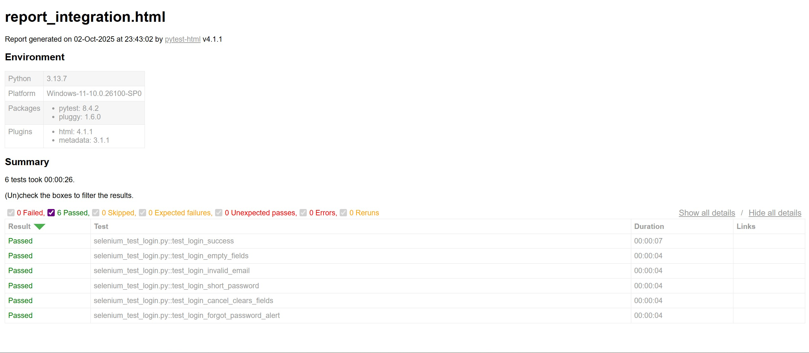
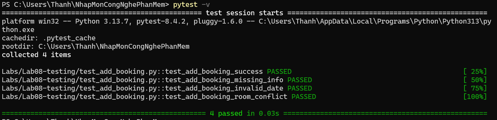
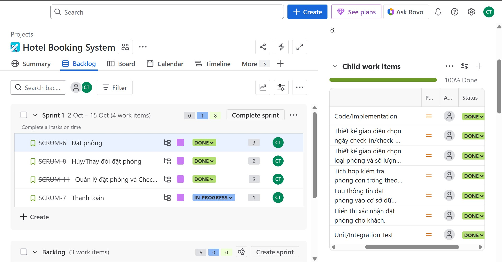
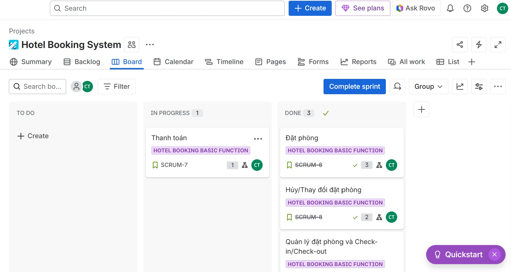
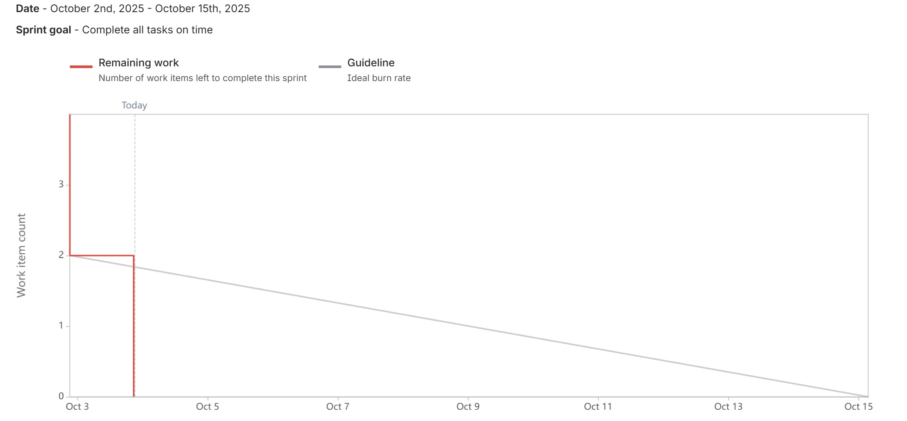

# Hệ thống đặt phòng khách sạn – Demo

## 🎯 Mục tiêu
- Hoàn thiện quy trình phần mềm từ **thiết kế** → **lập trình** → **triển khai**.  
- Tích hợp các artifacts: Use Case Diagram, Sequence Diagram, giao diện Front-end (Form Login).  
- Quản lý version bằng Git & GitHub.

---

## 1. Use Case Diagram
**Mô tả:** Hệ thống quản lý đặt phòng khách sạn gồm 3 tác nhân chính:
- **Khách hàng**: tìm kiếm, đặt phòng, thanh toán.  
- **Nhân viên lễ tân**: check-in, check-out, quản lý booking.  
- **Quản lý khách sạn**: quản lý phòng, xem báo cáo.  
- **Hệ thống thanh toán**: tích hợp xử lý giao dịch.

---

## 2. Sequence Diagram
**Mô tả:** Quy trình “Đặt phòng và Thanh toán trực tuyến”.

---

## 3. Giao diện Form Login (Front-end)
**File:** `index.html`  
**Ngôn ngữ:** HTML, CSS, JavaScript  
**Tính năng:**
- Nhập `username` (dạng email) và `password`.  
- Nút **Login** (giả lập xác thực) và **Cancel** (reset form).  
- Tùy chọn **Remember me** (lưu username vào `localStorage`).  
- Validation cơ bản bằng JavaScript.  

📂 Source code: [index.html](../Lab04/index.html)

Demo trên GitHub Pages:  
👉 [https://N23DCPT047.github.io/NhapMonCongNghePhanMem/](https://N23DCPT047.github.io/NhapMonCongNghePhanMem/)

---

## 4. Quy trình làm việc
1. **Thiết kế**
   - Vẽ Use Case.  
   - Vẽ Sequence Diagram cho quy trình nghiệp vụ.  

2. **Phát triển**
   - Code Form Login (`index.html`).  
   - Test local bằng trình duyệt.  

3. **Tích hợp**
   - Gom artifacts vào repo GitHub.  
 

4. **Triển khai**
   - Dùng GitHub Pages để chạy demo Form Login.  

---

## 5. Khởi tạo DB

CREATE TABLE KhachHang (
    maKH INT PRIMARY KEY AUTO_INCREMENT,
    hoTen VARCHAR(100),
    email VARCHAR(100) UNIQUE,
    soDT VARCHAR(15)
);

CREATE TABLE KhachSan (
    maKS INT PRIMARY KEY AUTO_INCREMENT,
    tenKS VARCHAR(100),
    diaChi VARCHAR(255)
);

CREATE TABLE Phong (
    maPhong INT PRIMARY KEY AUTO_INCREMENT,
    soPhong VARCHAR(20),
    loaiPhong VARCHAR(50),
    gia DECIMAL(10,2),
    tinhTrang VARCHAR(50),
    maKS INT,
    FOREIGN KEY (maKS) REFERENCES KhachSan(maKS)
);

CREATE TABLE DatPhong (
    maDP INT PRIMARY KEY AUTO_INCREMENT,
    ngayDat DATE,
    ngayNhan DATE,
    ngayTra DATE,
    maKH INT,
    maPhong INT,
    FOREIGN KEY (maKH) REFERENCES KhachHang(maKH),
    FOREIGN KEY (maPhong) REFERENCES Phong(maPhong)
);

CREATE TABLE HoaDon (
    maHD INT PRIMARY KEY AUTO_INCREMENT,
    ngayLap DATE,
    tongTien DECIMAL(10,2),
    maDP INT,
    FOREIGN KEY (maDP) REFERENCES DatPhong(maDP)
);
## 6. Kết quả test và sprint report

